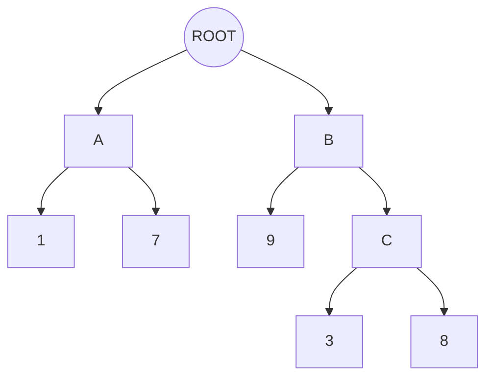

# Usage
{: .no_toc }

1. TOC
{:toc}

## The class hierarchy

A hierarchy is a rooted directed acyclic graph whose nodes are class labels and whose edges
point from a class to its sub-classes. Pass it as a `networkx.DiGraph` or as an adjacency
dict mapping each parent to its children. The root is the framework-provided `ROOT` sentinel
unless you set `root=` to a node of your own graph.

```python
from networkx import DiGraph

from sklearn_hierarchical_classification.constants import ROOT

# Equivalent hierarchies
as_dict = {ROOT: ["A", "B"], "A": ["1", "7"], "B": ["C", "9"], "C": ["3", "8"]}
as_graph = DiGraph(as_dict)
```



Intermediate nodes (`A`, `B`, `C` above) are labels like any other: a sample may be labelled
with one, and `predict` may return one when early stopping is on. Leave `class_hierarchy`
unset and `fit` builds a flat hierarchy linking every class in `y` to the root, which makes
the classifier a plain multi-class one.

{: .note }
Use node identifiers of a single type. Predictions are returned as a numpy array, and mixed
`int`/`str` labels would be coerced to strings.

### DAGs

A node may have several parents. Its training samples reach every ancestor once, and at
prediction time a node is scored once per call on the union of the samples that reached it
from all of its parents. In multi-label mode `predict_proba` reports, for a class under several
visited parents, the highest of its local scores, which is the quantity its threshold is
compared with.

## Training: one classifier per parent node

`fit` visits the hierarchy depth-first from the root and trains one local classifier at every
node that has children. The training set of a node is the samples labelled with any strict
descendant of the node; the targets are those labels rolled up to the node's children. A node
whose training targets hold a single child gets a constant predictor instead of a copy of the
base estimator, and a node with no training samples gets no classifier and a warning.

Training data is never copied per node: each local classifier is fitted on the rows of `X`
selected by index, so sparse input stays sparse and the fitted model keeps no reference to
the training set. After `fit`, `graph_` is the `DiGraph` holding a `classifier` and
`metafeatures` (`n_samples`, `n_targets`) on every trained node.

### Base estimators

`base_estimator` is any scikit-learn classifier exposing `predict_proba`, or
`decision_function` when `use_decision_function=True`. The default is
`LogisticRegression(solver="lbfgs", max_iter=1000)`.

To vary the estimator across the hierarchy, pass a dict keyed by node with the `DEFAULT`
constant as the catch-all, or a callable receiving the node and the graph as keyword arguments `node_id` and `graph`:

```python
from sklearn.svm import LinearSVC
from sklearn.linear_model import LogisticRegression

from sklearn_hierarchical_classification.constants import DEFAULT

clf = HierarchicalClassifier(
    base_estimator={ROOT: LinearSVC(), DEFAULT: LogisticRegression()},
    class_hierarchy=class_hierarchy,
    use_decision_function=True,
)

def estimator_for(node_id, graph):
    return LinearSVC() if graph.out_degree(node_id) > 5 else LogisticRegression()

clf = HierarchicalClassifier(base_estimator=estimator_for, class_hierarchy=class_hierarchy, use_decision_function=True)
```

The estimator is cloned for every node, so one instance can be shared. Estimators with
`decision_function` only (such as `LinearSVC`) need `use_decision_function=True`; a binary
`decision_function` returns one signed score, which is expanded to a score per class.

### Raw inputs and pipelines

With `feature_extraction="raw"`, `X` is a Python sequence of raw samples (strings, dicts,
anything) and the base estimator is a `Pipeline` that starts with feature extraction. Each
node's pipeline is then fitted on the node's own samples, so a text vectorizer builds a
vocabulary per node:

```python
from sklearn.feature_extraction.text import TfidfVectorizer
from sklearn.pipeline import make_pipeline

clf = HierarchicalClassifier(
    base_estimator=make_pipeline(TfidfVectorizer(), LogisticRegression()),
    class_hierarchy=class_hierarchy,
    feature_extraction="raw",
)
clf.fit(documents, labels)
```

A `Pipeline` also works in the default `"preprocessed"` mode on a feature matrix, for
example to run a per-node `TruncatedSVD`; see `examples/classify_digits.py` (runs from a source
checkout, as it uses the test fixtures).

## Prediction

`predict` walks each sample down from the root: at every visited node the local classifier
picks the child to descend into, and the walk ends at a leaf. Samples are batched, so each
local classifier is called once per `predict` regardless of the number of samples.

`predict_proba` returns a matrix over `classes_` (every node except the root) holding the
local score each class received along the sample's walk, and zero for classes at nodes
that were not visited. It is not a distribution over the leaves: scores at different depths
come from different classifiers.

### Early stopping

By default prediction always ends at a leaf (`prediction_depth="mlnp"`, mandatory leaf-node
prediction). With `prediction_depth="nmlnp"` the walk may stop at an intermediate node, which
is then the prediction. `stopping_criteria` decides, and is required in this mode:

- a `float`: stop when the local score of the chosen child is below it;
- a callable `f(current_node, prediction, score)` receiving the node's attributes dict (with
  its `metafeatures`), the chosen child and its score, returning `True` to stop.

The walk never stops at the root, so every sample gets at least one label.

```python
clf = HierarchicalClassifier(
    base_estimator=LogisticRegression(),
    class_hierarchy=class_hierarchy,
    prediction_depth="nmlnp",
    stopping_criteria=0.7,
)
```

Early stopping is a single-label feature and is rejected together with `mlb`.

## Progress and logging

`progress_wrapper` takes a `tqdm`-style callable (`tqdm`, `tqdm.notebook.tqdm`, ...) that is
called as `progress_wrapper(total=..., desc=...)` and wraps the training loop with it. Training
details are logged on the `HierarchicalClassifier` logger at `DEBUG` level; a node left without
training data logs a warning.

## Parameters at a glance

| Parameter | Default | Meaning |
|---|---|---|
| `base_estimator` | `None` (a `LogisticRegression` per node) | Estimator, dict by node (`DEFAULT` catch-all) or callable `(node_id=, graph=)`. |
| `class_hierarchy` | flat | `DiGraph` or adjacency dict rooted at `root`. |
| `root` | `ROOT` | Identifier of the root node. |
| `prediction_depth` | `"mlnp"` | `"nmlnp"` allows stopping at intermediate nodes. |
| `stopping_criteria` | `None` | Float or callable, required with `"nmlnp"`. |
| `algorithm` | `"lcpn"` | Local classifier per parent node. `"lcn"` is accepted but has no separate implementation. |
| `training_strategy` | `None` | `"siblings"` (default) or `"inclusive"` (multi-label only). See [Multi-label](multi-label). |
| `feature_extraction` | `"preprocessed"` | `"raw"` passes the raw samples to a pipeline base estimator. |
| `mlb` | `None` | Fitted `MultiLabelBinarizer` for multi-label targets. |
| `mlb_prediction_threshold` | `0.0` | One threshold, or one per `mlb.classes_`. |
| `mlb_min_root_predictions` | `0` | Root children forced on samples that would get none. |
| `use_decision_function` | `False` | Score with `decision_function` when the estimator has one. |
| `progress_wrapper` | `None` | `tqdm`-style wrapper for training progress. |
